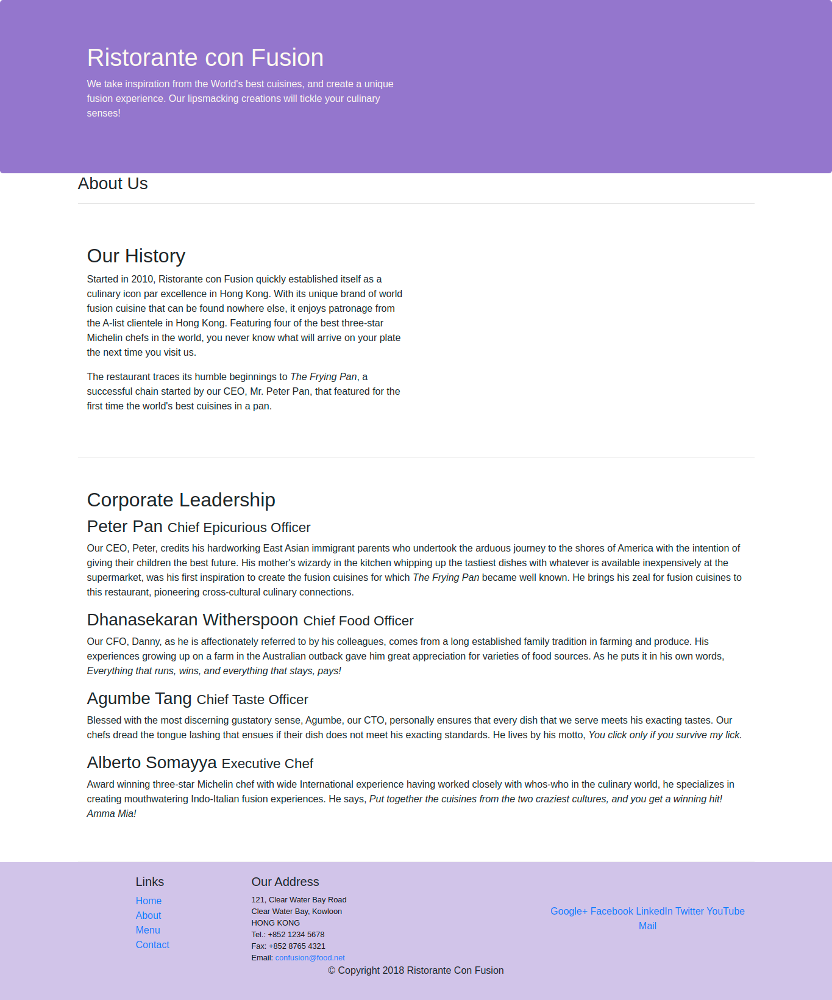

# Assignment 1: Bootstrap and Responsive Design

## Task 1

In this task you will be updating the aboutus.html page to make use of the Bootstrap classes and components:

* Update the page to make use of the Bootstrap CSS classes.
* Update the page to also use your custom styles defined in your styles.css file, and
* Update the page to make use of all the Bootstrap JS components.

## Task 2

In this task you will be adding appropriate formatting to the web page contents using container, row and column classes using the Bootstrap grid so that the web page is formatted to look like the figure given below.

* The "About Us" title should stretch the entire width of the row.
* The "Our History" part should occupy only half the width of the row for small to extra large screens, leaving space on the right side for more content to be added later. The content should be stacked for extra small screens.
* The "Corporate Leadership" section should stretch the entire width of the row.

## Task 3

In this task you will use some responsive utilities provided by Bootstrap to hide some of the content only for extra small screens. You will make use of the d-none and d-sm-block CSS classes provided by Bootstrap. To understand how to use these classes, please read the documentation [here](http://getbootstrap.com/docs/4.0/utilities/display/) (in particular see how the combination of classes shown [here](http://getbootstrap.com/docs/4.0/utilities/display/#hiding-elements) enables you to hide the content for xs screen sizes) to learn how to apply the d-none and d-sm-block classes. This will get you into the habit of consulting the Bootstrap documentation whenever you need to learn more about the various components and classes of Bootstrap. You should apply the classes so that the 
 elements containing the detailed descriptions of the corporate leadership is hidden only for extra small screens. Thus, your page should look like the figure below on extra small screens.

# Screenshots

## Task 1-2

## Task 3

