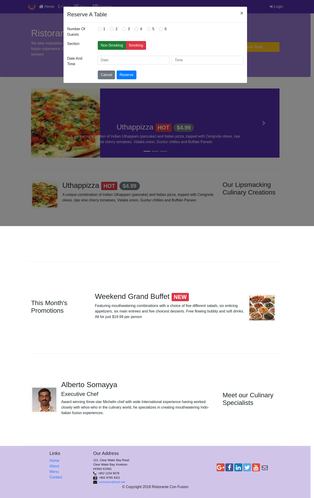

# Assignment 3: Bootstrap JavaScript Components

## Task 1

In this task you will move the table reservation form from the last content row into a modal. You should also remove the last content row.

* The form should be completely shifted to a modal.
* Add a Cancel button in the form that will dismiss the modal when clicked.
* The modal header should contain a X button to dismiss the modal.

## Task 2

In this task you will be adding a radio button group to the form to allow the selection of the smoking/non-smoking section of the restaurant.

* The radio button group should start out with the non-smoking section selected by default.
* The row containing the button group will have the label Section displayed preceding it in the form.

## Task 3

In this task you will be updating the Reserve Table button in the Jumbotron:

* Remove the tooltip from the button. This is to facilitate the button to be used to trigger the modal containing the table reservation form in the later tasks. A single button can support only one Javascript plugin via the data-* attributes. Make sure to remove the JavaScript script at the bottom of the page. Also remove the corresponding JavaScript code for the tooltip from the bottom of the page.
* You will update the Reserve Table button to show the modal containing the table reservation form when the button is clicked.

# Screenshots

## SM-MD Screen

